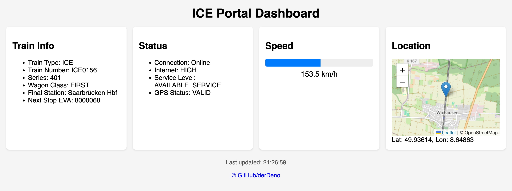

# Deutsche Bahn Dashboard


Deutsche Bahn ICE onboard (in train WiFi network) dashboard.

It uses the local api endpoints, that are available on the trains WiFi network.

## Usage

Due to CORS policies, this is wrapped into a docker container with a nginx proxy.
Build it yourself:

``` bash
docker build -t db-dash .
docker run --rm -p 3600:80 db-dash
```

Or use the provided image under packages

Default port is `3600`